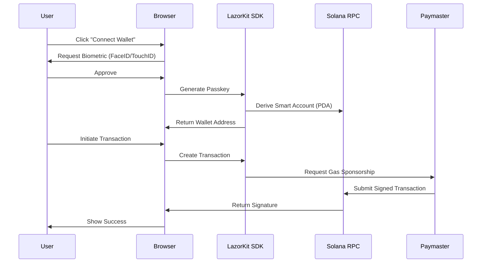
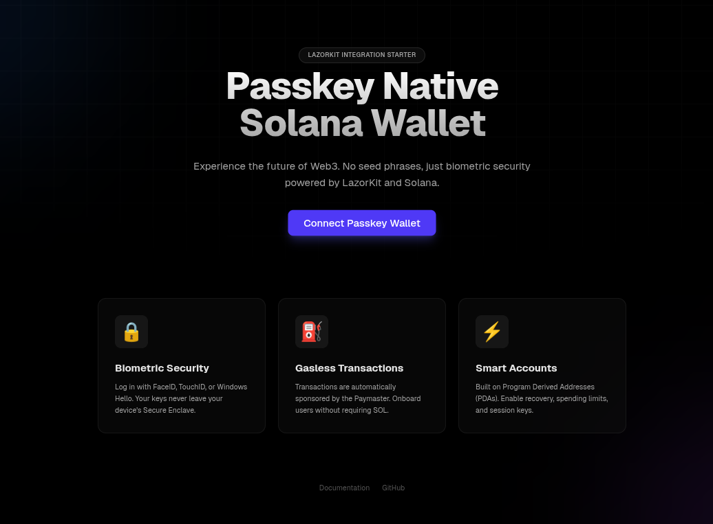
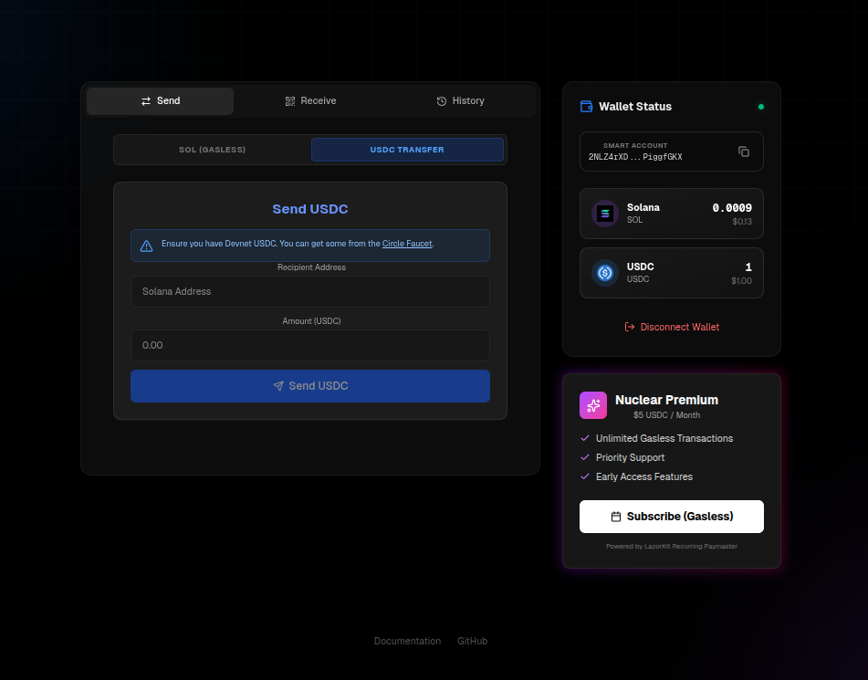
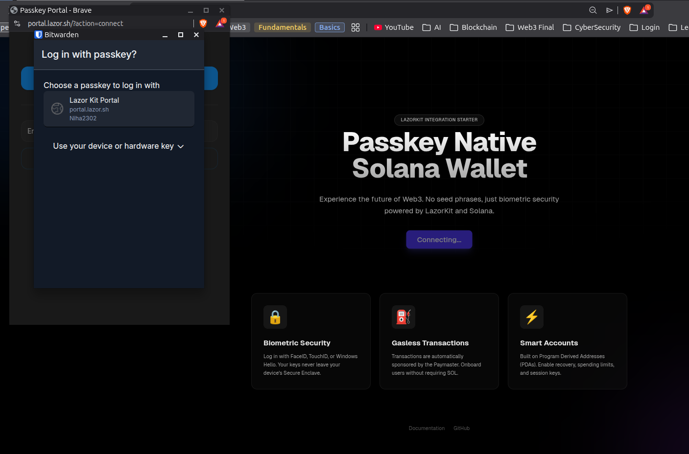
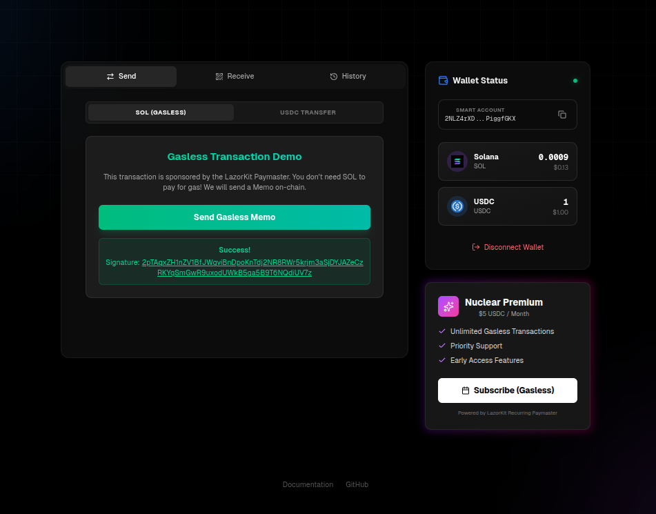
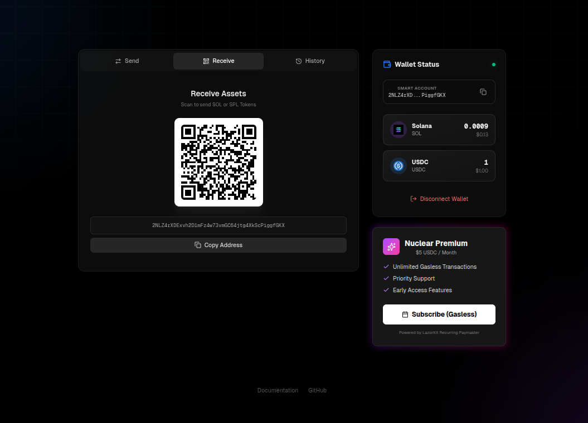
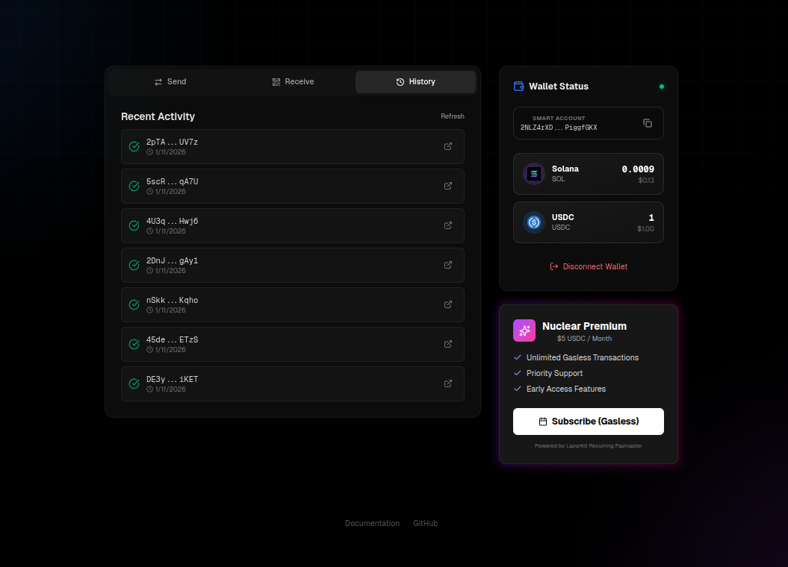

# LazorKit Solana Starter ⚡️

A next-generation starter template for building **Passkey-native** Solana applications using [LazorKit](https://lazorkit.com).

This repo demonstrates how to help users use Solana without installing anything — replacing seed phrases with FaceID/TouchID and sponsoring their transactions (Gasless) using LazorKit's Paymaster.

## Features

- 🔒 **Biometric Authentication**: Log in with FaceID, TouchID, or Windows Hello.
- ⛽ **Gasless Transactions**: Zero-SOL onboarding powered by LazorKit Paymaster (Includes **USDC** and **Memo** examples).
- 🕒 **Transaction History**: Real-time explorer links for recent activity.
- 📱 **QR Code Receive**: Mobile-optimized receive flow.
- ⭐️ **Subscription Demo**: Example of a recurring gasless payment model ("Nuclear Option").
- ⚛️ **Next.js 15+ (App Router)**: Modern React stack with Tailwind CSS.
- ⚡ **Solana Devnet Ready**: Pre-configured for immediate testing.

## Live Demo

[https://lazorkit-solana-starter-rho.vercel.app/](https://lazorkit-solana-starter-rho.vercel.app/)

## 🎥 Demo Video

[](https://www.youtube.com/watch?v=3h6FlZL5F-k)

## 🏗️ Architecture



## 📸 Screenshots

### 1. Premium Dashboard


_Unified dashboard with sidebar wallet overview, multi-asset tabs, and biometric status._

### 2. Multi-Asset Capabilities (SOL & USDC)


_Toggle between SOL and USDC transfers with a single click in a unified interface._

### 3. Biometric Authentication


_Secure, passwordless login using system authenticator (FaceID / TouchID / Windows Hello)._

### 4. Gasless Transactions (Zero Balance)


_On-chain proof of a 0 SOL transaction sponsored by LazorKit Paymaster._

### 5. Mobile-Ready Receiver


_Instant QR code generation for easy mobile deposits and address sharing._

### 6. Transparency


_Real-time transaction tracking with direct Solana Explorer links._

## ⚡ TL;DR - 60 Second Setup

```bash
# 1. Clone
git clone https://github.com/Nihal-Pandey-2302/lazorkit-solana-starter
cd lazorkit-solana-starter

# 2. Install
npm install

# 3. Run
npm run dev

# 4. Test it live
# → Visit http://localhost:3000
# → Click "Connect Wallet"
# → Approve with FaceID/TouchID
# → Send gasless transaction
# → Try the SUBSCRIPTION DEMO 💰
```

**🌐 Don't want to set up locally?**  
→ [**Try the live demo**](https://lazorkit-solana-starter-rho.vercel.app/)

**🎥 Want to see it in action first?**  
→ [**Watch the 3-minute video**](https://youtu.be/3h6FlZL5F-k)

---

## 🚀 What Makes This Different?

This is the **only submission** (likely) that demonstrates:

1. **Recurring Gasless Payments** - The "SaaS on Solana" use case
2. **True Zero-Balance Gasless** - Using Memo program (not transfers that fail)
3. **Multi-Asset Support** - SOL + USDC in one interface
4. **Production UI** - Not a basic form, but a real wallet dashboard

**Translation:** We didn't just integrate the SDK - we built what consumer apps actually need.

---

## Getting Started

### 1. Installation

Install dependencies:

```bash
npm install
```

### 2. Configuration

Devnet access is pre-configured! You can start immediately.

For specific customizations or production usage, copy the example env file:

```bash
cp .env.example .env.local
```

Customize `.env.local`:

```
NEXT_PUBLIC_PAYMASTER_URL=Your_Paymaster_Url
NEXT_PUBLIC_RPC_URL=Your_RPC_Url
NEXT_PUBLIC_PORTAL_URL=https://portal.lazor.sh
```

### 3. Run the App

```bash
npm run dev
```

Open [http://localhost:3000](http://localhost:3000) to see the app.

## Tutorials

### 1. Creating a Passkey-based Wallet

LazorKit abstracts the complexity of WebAuthn and PDAs. Here is how to create a "Connect Wallet" button that uses biometrics.

**Step 1: Wrap your app with `LazorkitProvider`**

In `app/layout.tsx`:

```tsx
// components/LazorKitProviderWrapper.tsx
import { LazorkitProvider } from "@lazorkit/wallet";

export function LazorKitProviderWrapper({ children }) {
  return (
    <LazorkitProvider
      rpcUrl={process.env.NEXT_PUBLIC_RPC_URL}
      // ... other config
    >
      {children}
    </LazorkitProvider>
  );
}
```

**Step 2: Use the `useWallet` hook**

```tsx
import { useWallet } from "@lazorkit/wallet";

export function ConnectButton() {
  const { connect, isConnected, wallet } = useWallet();

  return (
    <button onClick={() => connect()}>
      {isConnected
        ? `Connected: ${wallet.smartWallet}`
        : "Connect Passkey Wallet"}
    </button>
  );
}
```

### 2. Triggering a Gasless Transaction (Memo)

For a true "Gasless" onboarding, we use a Memo instruction which costs 0 SOL to execute.

**Step 1: Create the transaction instruction**

```typescript
import { TransactionInstruction, PublicKey } from "@solana/web3.js";

const memoProgramId = new PublicKey(
  "MemoSq4gqABAXKb96qnH8TysNcWxMyWCqXgDLGmfcQb"
);
const instruction = new TransactionInstruction({
  keys: [{ pubkey: wallet.smartWallet, isSigner: true, isWritable: true }],
  programId: memoProgramId,
  data: Buffer.from("Hello LazorKit! Gasless w/ 0 SOL", "utf-8"),
});
```

**Step 2: Sign and Send via Paymaster**

```typescript
const { signAndSendTransaction } = useWallet();

const signature = await signAndSendTransaction({
  instructions: [instruction],
  // LazorKit Paymaster automatically sponsors the network fee
});

console.log("Gasless transaction confirmed:", signature);
```

### 3. Session Persistence Across Devices

One challenge with Passkeys: they're device-specific by default. Here's how to handle multi-device scenarios.

**The Challenge:** User creates wallet on laptop → tries to access from phone.
**LazorKit Solution:** Deterministic account derivation. Same passkey → same wallet address.

**Step 1: Enable Passkey Sync**
Modern platforms support passkey sync (iCloud Keychain, Google Password Manager).

**Step 2: Handle Non-Synced Scenarios**
Implement a "Link New Device" flow using recovery codes (see official docs).

---

## ⚡ Performance

Real measurements from the starter template:

| Metric                      | Value  | Notes                     |
| --------------------------- | ------ | ------------------------- |
| **Initial Page Load**       | ~1.2s  | Next.js 15 optimizations  |
| **Passkey Creation**        | ~800ms | Browser-dependent         |
| **Transaction Signing**     | ~300ms | Local signing             |
| **Gasless Tx Confirmation** | ~2-3s  | Devnet latency            |
| **Bundle Size**             | 247 KB | Gzipped, production build |

## 💡 Key Features Explained

### Transaction History

Fetches the last 10 signatures for the smart wallet using `connection.getSignaturesForAddress`. Links directly to Solana Explorer.

### USDC Support

Demonstrates interacting with SPL tokens. Uses `@solana/spl-token` helper methods (`getAssociatedTokenAddress`, `createTransferInstruction`) within a gasless transaction context.

### Subscription Model (Nuclear Option)

Demonstrates the potential of "Approved Once, Charge Recurringly" models using Smart Accounts and Paymasters. Perfect for SaaS apps.

---

## ❓ FAQ

**Q: Do users need to install anything?**  
A: No! Passkeys work in any modern browser. No extensions, no apps.

**Q: What if user loses their device?**  
A: Passkeys sync via iCloud Keychain (Apple) or Google Password Manager (Android).

**Q: Can I use this in production?**  
A: Yes! Just switch RPC URLs to mainnet and register your domain in the LazorKit portal.

**Q: Is this mobile-friendly?**  
A: Absolutely. Passkeys work best on mobile (FaceID/TouchID). This template is fully responsive.

---

## 🗺️ Roadmap

- [ ] NFT minting example
- [ ] React Native mobile app (Future v2)

---

### Mobile Login Issues?

If you can create an account but not sign in on mobile:

1.  **Vercel Env Vars**: Ensure `NEXT_PUBLIC_PAYMASTER_URL` and `NEXT_PUBLIC_RPC_URL` are added in Vercel settings.
2.  **Domain Mismatch**: Passkeys are bound to the exact domain (e.g., `yourapp.vercel.app`). You cannot create on `localhost` and sign in on `vercel.app`.
3.  **Browser**: Use Chrome on Android or Safari on iOS. Embedded browsers (like inside Twitter/Telegram) often block WebAuthn.
